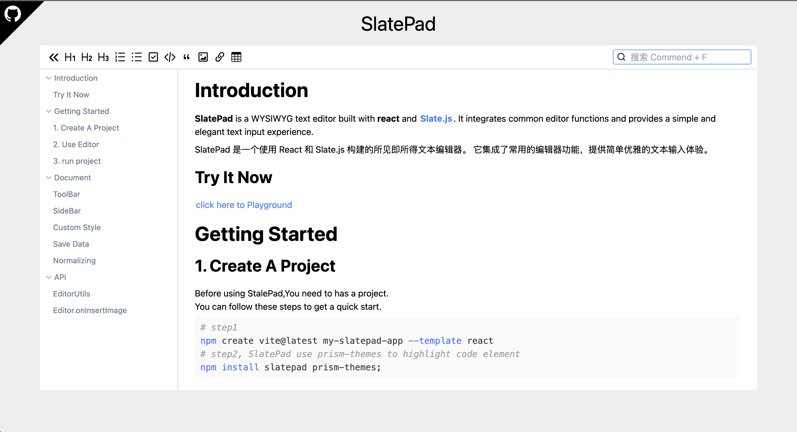

# SlatePad

slatepad is a WYSIWYG text editor built with react and [Slate.js](https://github.com/ianstormtaylor/slate). It integrates common editor functions and provides a simple and elegant text input experience.

SlatePad 是一个使用 React 和 Slate.js 构建的所见即所得文本编辑器。 它集成了常用的编辑器功能，提供简单优雅的文本输入体验。

## Try It Now

[click here to Playground](https://qirong77.github.io/SlatePad/)

